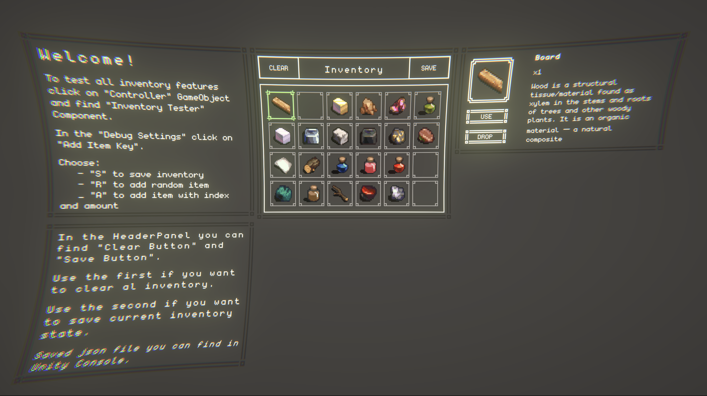

# Система инвентаря с Drag & Drop

  

## Описание:
Простая, но функциональная система инвентаря в Unity. Фокус на логику, интерфейс и архитектуру. 
Cистема масштабируема, а также настроен приятный визуал за счет URP.

### Инвентарь:
- Ячейки с фиксированным количеством слотов (например, 5x4).
- Поддержка нескольких типов предметов (например: оружие, зелье, квест-предмет).
- Предметы могут быть "стекомыми" (например, зелья) и не стекаемыми (например, оружие).

### Предметы:
Каждый предмет имеет следующие характристики:
- Название;
- Иконка;
- Описание;
- Тип (enum);

Реализовано через ScriptableObject.
### Функционал:
- Перетаскивание предметов между слотами (drag & drop).
- Использование предмета по кнопке "Use".
- Удаление предмета по кнопке "Drop".
- Сохранение инвентаря через PlayerPrefs и JSON.
- Tooltip меню.

### Гайд по использованию внутри проекта!

## Установка
- В разделе Release GitHub репозитория находиться .untypackage архив.
- Скачайте архив.
- Откройте Unity.
- Откройте .unitypackage через Unity.
- Import All.
